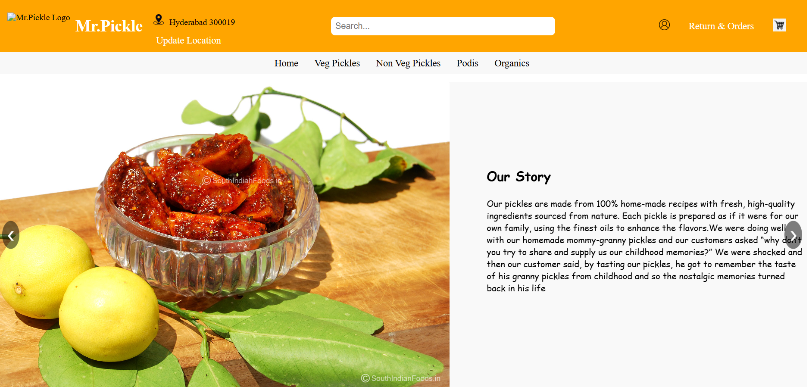
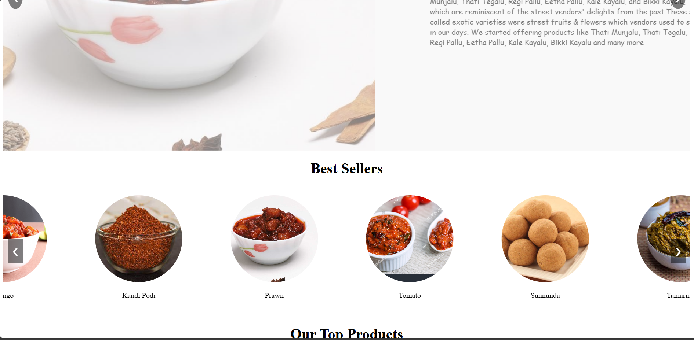
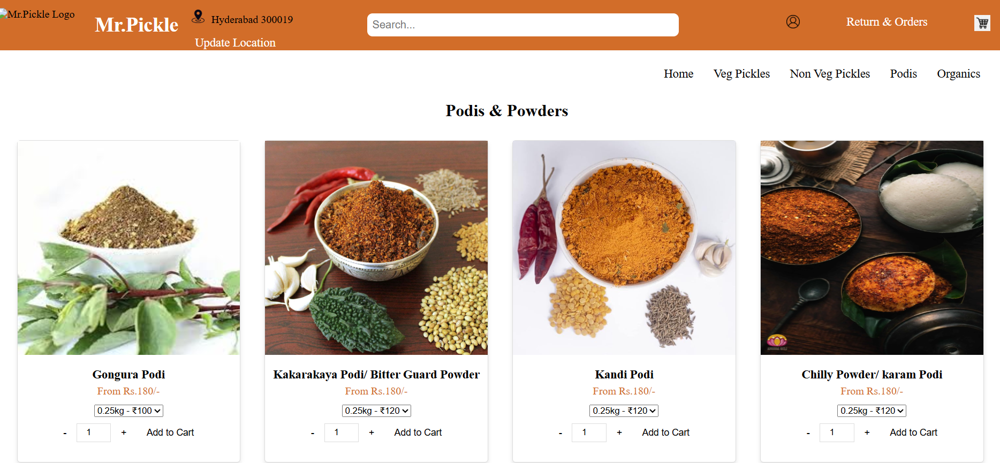
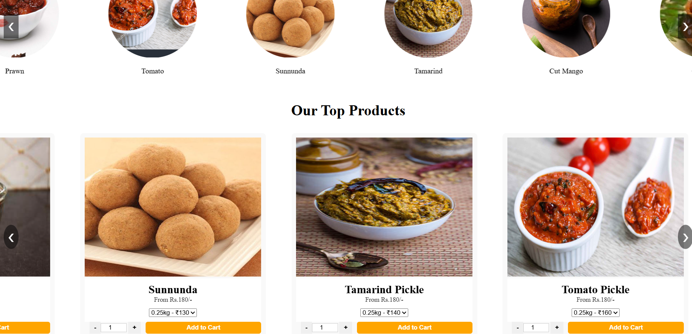

# 🥒 Mr. Pickle - Front -end Pickle Store Website

Welcome to **Mr. Pickle**, an online full-stack web application where users can explore a wide variety of delicious homemade pickles.  
This project demonstrates a fully responsive front-end design built with **HTML**, **CSS**, and **JavaScript**.

---

## 📸 Website Screenshots

---

### 🏠 Home Page

---

### 📚 Categories Page

---

### 📚 Podis Page

---

### 📚 Products Page

---

## 📂 Project Structure

Full-stack-Website---Mr.Pickle/
│
├── index.html             # Main homepage
├── categories.html        # Categories page listing all pickles
├── cart.html              # Shopping cart page
├── about.html             # About Mr. Pickle
├── contact.html           # Contact page
│
├── css/
│   ├── style.css          # All styling for the website
│
├── js/
│   ├── script.js          # JavaScript for interactivity
│
├── images/
│   ├── HomePage.png       # Homepage screenshot
│   ├── Categories.png     # Categories screenshot
│   ├── [Other images]     # Product, banner, and category images
│
└── README.md              # Documentation

---

## 🚀 Features

- Modern and responsive UI across all devices (Mobile, Tablet, Desktop)
- Home page with attractive banners and call-to-action buttons
- Categories section for different types of pickles (Vegetarian, Non-Vegetarian, Podis)
- Shopping Cart page to review selected items
- About Us page detailing the Mr. Pickle story
- Contact Us page with a form for customer inquiries
- Fully modular file structure separating HTML, CSS, and JavaScript

---

## ⚙️ How to Run Locally

# 1. Clone the repository
git clone https://github.com/2020ucp1070/Full-stack-Website---Mr.Pickle.git
cd Full-stack-Website---Mr.Pickle

# 2. No server installation required! Just open the files directly.
Open `index.html` in your browser.

# 3. (Optional) To simulate a real server environment:
Use Live Server extension in VS Code for auto-refresh and better local experience.

---

## 📜 Tech Stack

- **HTML5** – Structuring web pages
- **CSS3** – Styling and layout designs
- **JavaScript (Vanilla JS)** – Adding interactivity
- **Responsive Design** – Mobile-first approach

---

## ✨ Key Highlights

- Clean, elegant UI/UX with intuitive navigation.
- Structured, scalable codebase for future full-stack integration (backend APIs).
- Best practices followed for SEO-friendly and accessible web development.
- Optimized images and assets for faster loading.
- Clear call-to-actions to enhance user engagement and conversion.

---

## 📈 Future Enhancements

- Integrate Django/Python backend with database (MySQL)
- Implement user authentication (Login/Signup)
- Add payment gateway integration for real-time ordering
- Create dynamic product listings from a server database

---

## 📩 Contact Information

👩‍💻 Author: Anitha Dommari  
📧 Email: danitha200204@gmail.com  
🔗 LinkedIn: https://www.linkedin.com/in/d-anitha-990806237/ 

---

## 📜 License

This project is licensed under the MIT License.  
Feel free to use, modify, and build upon this project with attribution.

---
